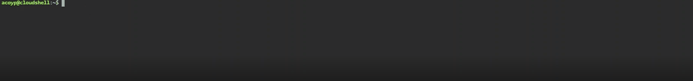
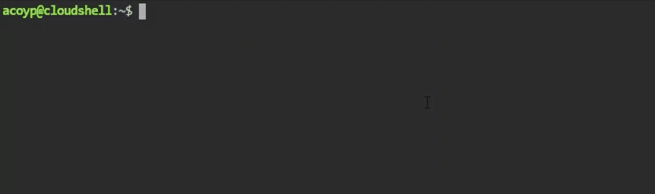
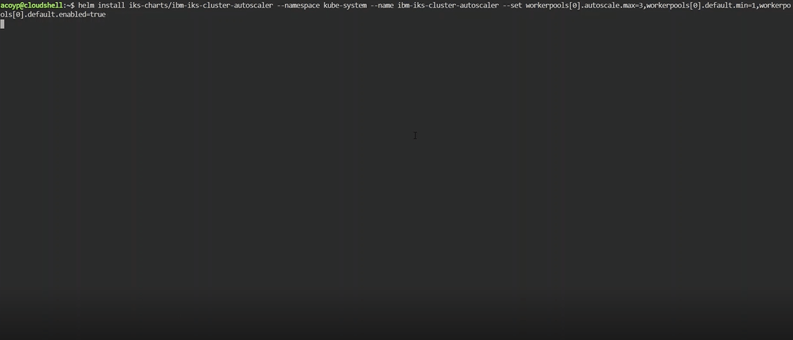

# IBM-Cloud-Kubernetes--Auto-Scaling

_Ejemplo de configuración de Worker Pool para autoescalamiento_

## Comenzando 🚀

Para la configuración de Autoescalamiento de un Cluster se requiere del acceso a la CLI de Kubectl usando las instrucciones que se muestran a continuación para cada comando.



## Instrucciones 📋

Confirme que las credenciales de IBM Cloud Identity and Access Management están almacenadas en el clúster. El programa de escalado automático de clústeres utiliza este secreto para autenticar las credenciales. Si falta el secreto, créelo restableciendo las credenciales.

**Linux**
```
kubectl get secrets -n kube-system | grep storage-secret-store
```
**Windows**
```
kubectl get secrets -n kube-system
```


Compruebe si la agrupación nodos trabajadores tiene la etiqueta necesaria.

**Linux**
```
ibmcloud ks worker-pool get --cluster <cluster_name_or_ID> --worker-pool <worker_pool_name_or_ID> | grep Labels
```
**Windows**
```
ibmcloud ks worker-pool get --cluster <cluster_name_or_ID> --worker-pool <worker_pool_name_or_ID>
```


Prepare el clúster para el escalado automático.
Siga las instrucciones para instalar el cliente Helm versión 3 en la máquina local.
Añada y actualice el repositorio de Helm en el que se encuentra el diagrama de Helm del programa de escalado automático de clústeres.
**Windows**
```
helm repo add iks-charts https://icr.io/helm/iks-charts

helm repo update
```
**Windows**
```
helm repo add iks-charts https://icr.io/helm/iks-charts

helm repo update
```
### Visión general de las opciones de --set workerpools

Decida si desea personalizar los valores del programa de escalado automático del clúster, como las agrupaciones de trabajadores que se escalan automáticamente o el intervalo de tiempo que el programa de escalado automático del clúster espera antes de que se aumente o se reduzca el número de nodos trabajadores. Puede personalizar los valores mediante el distintivo --set en el mandato helm install. En función de los valores que desee personalizar, es posible que tenga que preparar varios distintivos --set antes de poder instalar el diagrama de Helm. Por ejemplo, es posible que desee escalar automáticamente la agrupación de nodos trabajadores predeterminada preparando el siguiente distintivo --set. 
- Nota: si el shell predeterminado es zsh, inicie una sesión bash antes de ejecutar el mandato siguiente.

**Configuración de worker pools**
```
--set workerpools[0].<pool_name>.max=<number_of_workers>,workerpools[0].<pool_name>.min=<number_of_workers>,workerpools[0].<pool_name>.enabled=(true|false)
```

- workerpools[0]: la primera agrupación de nodos trabajadores que se habilita o inhabilita para el escalado automático. 
- Debe incluir tres parámetros para cada agrupación de nodos trabajadores para que el mandato se ejecute correctamente: el número máximo de nodos trabajadores (max), el número mínimo de nodos trabajadores (min) y si desea habilitar (true) o inhabilitar (false) el ajuste automático para esta agrupación de nodos trabajadores. 
- Para incluir varias agrupaciones de nodos trabajadores, incluya una lista separada por comas y aumente el número entre corchetes, como por ejemplo: workerpools[0].default...,workerpools[1].pool1...,workerpools[2].pool2....
- <pool_name>: el nombre o el ID de la agrupación de nodos trabajadores que desea habilitar o inhabilitar para el escalado automático. 
- Para ver una lista de las agrupaciones de nodos trabajadores disponibles, ejecute ibmcloud ks worker-pool ls --cluster <cluster_name_or_ID>.
- max=<number_of_workers>: especifique el número máximo de nodos trabajadores por zona a los que el programa de escalado automático del clúster puede escalar. El valor debe ser igual o mayor que el valor que establezca para el tamaño min=<number_of_workers>.
- min=<number_of_workers>: especifique el número mínimo de nodos trabajadores por zona a los que el programa de escalado automático del clúster puede escalar. El valor debe ser 2 o superior para que los pods de ALB se puedan propagar para alta disponibilidad. Si inhabilita todos los ALB públicos en cada zona de su clúster estándar, puede establecer el valor en 

**_Tenga en cuenta que el hecho de establecer un tamaño min no activa automáticamente un aumento. El tamaño min es un umbral de modo que el programa de escalado automático del clúster no escala por debajo de este número mínimo de nodos trabajadores por zona. Si el clúster no tiene todavía este número de nodos trabajadores por zona, el programa de escalado automático del clúster no aumenta el número de nodos hasta que tenga solicitudes de recursos de carga de trabajo que requieran más recursos._**

- enabled=(true|true|false): establezca el valor en true para habilitar el programa de escalado automático del clúster para escalar la agrupación de nodos trabajadores. Establezca el valor en false para detener el escalado de la agrupación de nodos trabajadores por parte del programa de escalado automático de clústeres. Más adelante, si desea eliminar el programa de escalado automático de clústeres, primero deberá inhabilitar cada agrupación de nodos trabajadores en el mapa de configuración.



Posterior a ingresar el comando se obtendrá respuesta con la información de los recursos configurados y luego de ello so podrá analizar el ConfigMap del Cluster configurado para autoescalamiento con el siguiente comando 

´´´
 kubectl get cm iks-ca-configmap -n kube-system -o yaml
´´´ 
El cual entrega la información de las configuraciones del CLUSTER al cual se encuentra conectado, de la siguiente manera:


Como se puede observar, se cuenta con la configuración del autoescalamiento del cluester en formato JSON donde se evidencia el máximo y mínimo número de nodos de acuerdo a la necesidad de los despliegues o el uso de la plataforma de Kubernetes